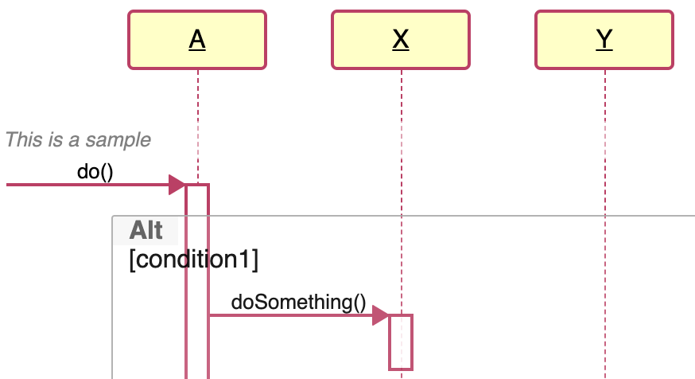
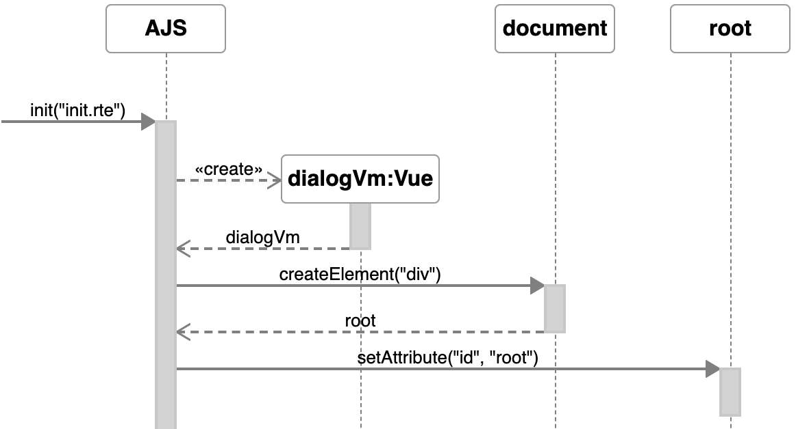
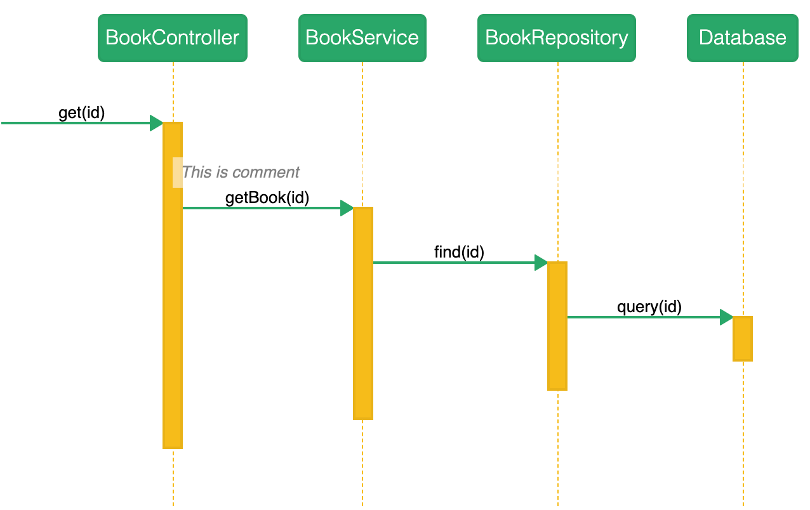

# Customizing

## Coloring and styles

When using ZenUML website and the Chrome extension, you can put in CSS to give your diagrams colors and styles.

Here is a few classic styles that you can start with:

## Traditional UML



This is a built-in style. When you click “New”, if you choose “StarUML” you get this style pre-populated for you in the CSS tab.

The built-in style was coded as LESS. Below I have converted it into CSS.

```css
#diagram .sequence-diagram .lifeline .participant {
  font-weight: 400;
  border: 2px solid #b94065;
  background: #fffec8;
}
#diagram .sequence-diagram .lifeline .participant label {
  text-decoration: underline;
}
#diagram .sequence-diagram .lifeline .line {
  border-left-color: #b94065;
}
#diagram .sequence-diagram .message {
  border-bottom-color: #b94065;
}
#diagram .sequence-diagram .message svg polyline {
  fill: #b94065;
  stroke: #b94065;
}
#diagram .sequence-diagram .message.self svg > polyline:not(.head) {
  fill: none;
}
#diagram .sequence-diagram .occurrence {
  background-color: white;
  border: 2px solid #b94065;
}
```

## Light modern

This style is achieved with only 4 lines of CSS.

```css
#diagram .participant {
  border: 1px solid;
  border-color: hsla(0, 0%, 0%, 0.4);
}
```



## Green-Orange

This style picked the main colors from Chrome’s icon.

```css
#diagram .participant {
  border-radius: 5px;
  font-weight: 300;
  color: white;
  background: #27a768;
}

#diagram .lifeline .line {
  border-color: #f5bc1a;
}

#diagram .message {
  border-color: #27a768;
}

#diagram .message .fill svg.arrow polyline{
  fill: #27a768;
  stroke: #27a768;
}

#diagram .message svg.arrow polyline{
  fill: #27a768;
  stroke: #27a768;
}

#diagram .message.self svg.arrow polyline{
  fill: none;
}

#diagram .message.self svg.arrow polyline.head{
  fill: #27a768;
}

#diagram .occurrence {
  background: #f5bc1a;
}
```

