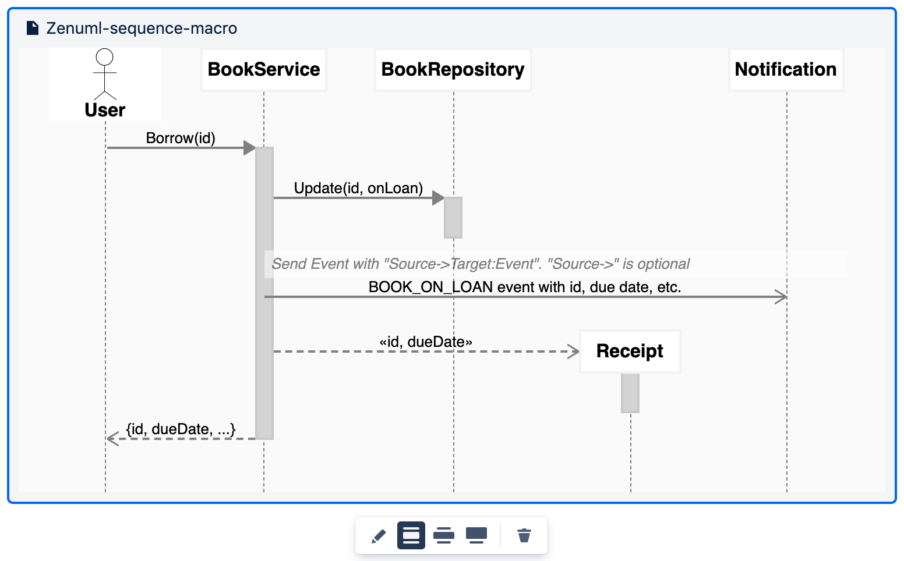
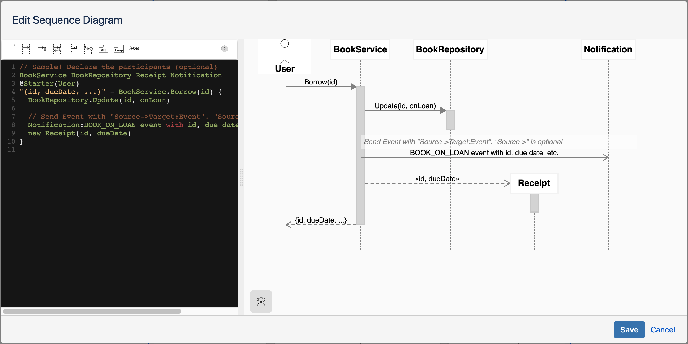
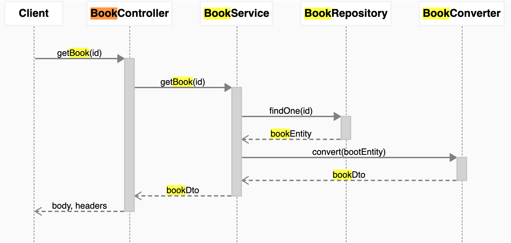

# Getting Started

Start using the ZenUML confluence plugin in 5 minutes

A ZenUML diagram can be created within any Confluence page, provided you have permission to edit the page.

ZenUML can be inserted like any other macro, using the macro browser. Click the drop down menu in the toolbar with the plugin icon, then click on “ZenUML Sequence Diagram”. If “ZenUML Sequence Diagram” is not directly in this menu, click on “Other macros” or “View more” and then enter “zenuml” in the search field at the top right of the dialog.

The default sequence diagram as below:

## Edit

Click the PEN icon below the macro to enter the edit mode.

## Save

When you finished editing, you can save the diagram by clicking the “Save” button. After saving a diagram, it can be edited at any time - click on the diagram, and then click on the PEN icon in the toolbar.

## View

In view mode, you can search on the diagram by using standard browser searching functionality.

