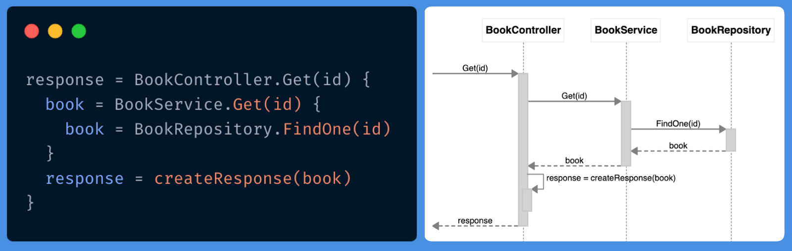

# ZenUML

[ZenUML](https://zenuml.com) is a sophisticated software modeler aimed to support agile and concise modeling with sequence diagrams.

## Features

* Multi-platform support (Web, Atlassian confluence, VS Code, JetBrains)
* UML 2.x standard compliant
* Rapid drawing without drag-and-drop
* Export to PNG/JPEG and PDF (on some platforms)

The main targets of users

* Agile development teams
* Professional persons
* Educational institutes

## Install

Get the “Freemium” [ZenUML plugin via Atlassian Marketplace](https://marketplace.atlassian.com/apps/1218380/zenuml-diagrams-for-confluence-freemium?src=doc)

