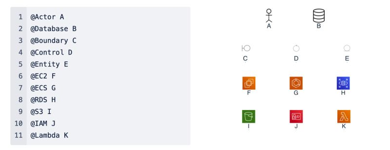
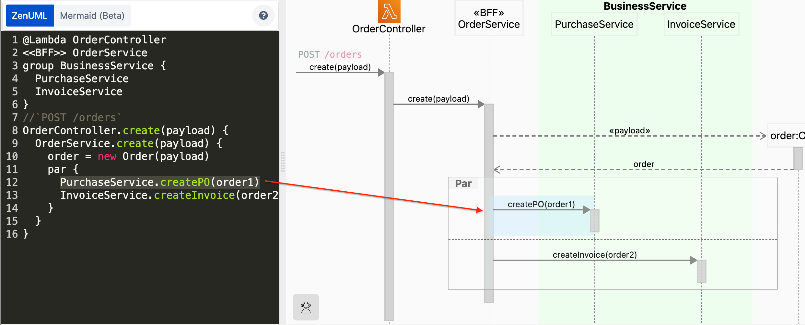
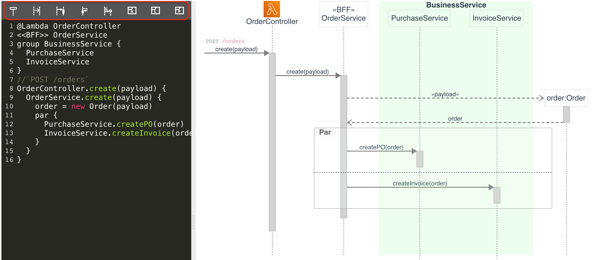

# What is new?

## Annotate `Participant` and more new syntax



For more new syntax, checkout [Sequence Diagram Syntax](./sequence-diagram-syntax.md)

## Highlight diagram messages / code
When you move the cursor in the code editor, the corresponding message will be highlighted; if you click a message in the diagram, the corresponding code will be highlight in the editor.



## Quick toolbar



## ZenUML Graph
A new macro has been added to the ZenUML plugin. With this new macro you can draw any diagram you like. We are migrating text to digram feature to this new macro.


This macro is built on top of mxgraph - https://jgraph.github.io/mxgraph/.

# Markdown in comments

Some of the features are only available on the confluence cloud platform and via [the full (paid) version](https://marketplace.atlassian.com/apps/1218380/zenuml-diagrams-for-confluence-freemium?src=doc-demo).

The above diagram is generated from the following code:

```
// `POST order`
//
// - [ ] Setup loadbalancer
// - [x] Config Kong gateway - [instrucions](document)
OrderController.create() {

  // Create an **immutable** order
  // - [ ] Build a microservice
  OrderService.create() {
    // | id | Prod_Name | Price | Inserted_At |
    // |----|-----------|-------|-------------|
    // |123 | book 1    | $10.00| 2020-06-30  |
    OrderRepo.save()
  }
}
```

## Mermaid diagrams

In the latest version, we have integrated mermaid into the plugin.