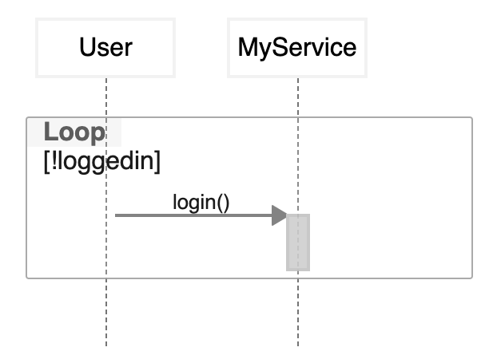

# Use Cases

## How can I represent an infinite loop in a sequence diagram?

```
// The diagram is generated with the following code.
// Test it on https://app.zenuml.com
@Starter(User)
while(!loggedin) {
  MyService.login()
}
```



ref: [stackoverflow](https://stackoverflow.com/questions/67213882/how-can-i-represent-an-infinite-loop-in-a-sequence-diagram)